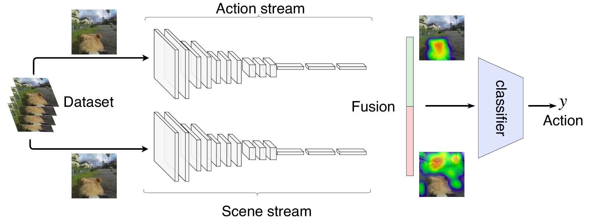

# Using Scene Context to Improve Action Recognition

This page contains a supplemental material to the paper entitled "Using Scene Context to Improve Action Recognition" published in the Iberoamerican Congress on Pattern Recognition (CIARP 2018) by Juarez Monteiro and Roger Granada and Felipe Meneguzzi and Rodrigo C. Barros. The full text can be found in [Springer page](https://link.springer.com/chapter/10.1007%2F978-3-030-13469-3_110).

---
## Abstract

Recently action recognition has been used for a variety of applications such as surveillance, smart homes, and in-home elder monitoring. Such applications usually focus on recognizing human actions without taking into account the different scenarios where the action occurs. In this paper, we propose a two-stream architecture that considers not only the movements to identify the action, but also the context scene where the action is performed. Experiments show that the scene context may improve the recognition of certain actions. Our proposed architecture is tested against baselines and the standard two-stream network.

---
## Method

To address the contextual awareness on action recognition, our approach aims to use the context of the scenes by fusing the information of the background with the information that identifies the action being performed in a two-stream architecture. Our architecture is composed by a stream containing a CNN to identify the action happening in the current frame, and a CNN to identify where (scene context) the action is happening in the current frame, as illustrated in in the image below.



The idea of this architecture is that the CNN responsible for the action stream focuses on the movements that are being performed to identify an action, while the CNN responsible for the scene stream focuses on the background where the action happens. For example, consider two actions that contain similar movements, such as baseball swing and tennis swing. While the action stream may identify the swing performed in the action, the scene stream identifies the context where the swing is happening, increasing the chance to correctly classify the action. Features from both streams are connected in a late fusion approach and a classifier predicts the action performed on the input image. 


---
## How to cite

When citing our work in academic papers, please use this BibTeX entry:

```
@inproceedings{MonteiroEtAl2018ciarp,
  author    = {Monteiro, Juarez and Granada, Roger and Meneguzzi, Felipe and Barros, Rodrigo C},
  title     = {Using Scene Context to Improve Action Recognition},
  booktitle = {Progress in Pattern Recognition, Image Analysis, Computer Vision, and Applications},
  series    = {CIARP 2018},
  location  = {Madrid, Spain},
  pages     = {954--961},
  isbn      = {978-3-030-13469-3},
  doi       = {10.1007/978-3-030-13469-3_110},
  url       = {https://doi.org/10.1007/978-3-030-13469-3_110},
  month     = {November},
  year      = {2019},
  publisher = {Springer International Publishing}
}
```

---
## Acknowledgment

This study was financed in part by the Coordenação de Aperfeiçoamento de Pessoal de Nível Superior (CAPES) and Fundação de Amparo à Pesquisa do Estado do Rio Grande do Sul (FAPERGS) agreement (DOCFIX 04/2018). We gratefully acknowledge the support of NVIDIA Corporation with the donation of the Titan Xp GPU used for this research.
